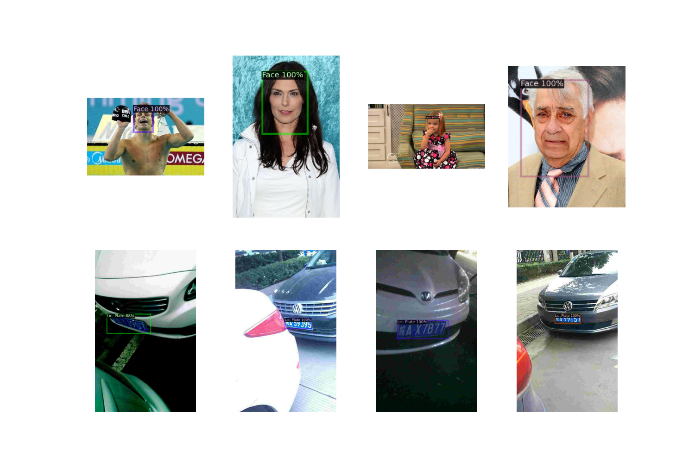

# AI-based Data Redaction for GDPR Compliance

## Overview
The General Data Protection Regulations (GDPR) enforces rules relating to the protection of natural persons with regards to the processing of personal data and rules relating to the free movement of personal data. This is done to protect fundamental rights and freedoms of natural persons and in particular their right to the protection of personal data. To comply with GDPR, companies have to redact information that exposes personal details about individuals as stated in the GDPR manual. These details include human faces and license plates.

In light of this, AI can do a great job in determining the position of such information in available data. Our project aims to create a pipeline to pre-process data using AI by automatically determining the location of faces and/or license plates in an image.

## Project Plan
In order to get a model that can accurately annotate images that might or might not contain faces and/or license plates, the process involves the following steps:
- [x] Dataset selection 
- [x] Data preparation 
- [x] Model selection
- [x] Training
- [x] Evaluation
- [x] Candidate Model Selection
- [ ] Train Candidate Model on a Larger Data Sample

### Plan Details
#### Dataset Selection
Face Detection Dataset: CelebA (205999 annotated faces).
License Plates Detection Dataset: Chinese City Parking Data (350k annotated license plates).

#### Data Preparation
Datasets are saved on Google Drive. The preparation pipeline goes as follows: download -> extract -> read -> decode (from papers instructions) -> convert to COCO Format -> save info as JSON files to be instantly registered upon training.

#### Model Selection
We fine-tuned 6 pre-trained checkpoints from detectron2’s model zoo.

#### Training
Training parameters are fixed amongst all 6 trials.

#### Evaluation
Evaluate the trained models on Average Precision (AP) metric.

#### Candidate Model Selection
Select the model with the highest AP.

## Implementation Details

### Environment Setup
    `conda create -n myenv --file requirements.txt`

### Dataset Selection
Datasets are available on Google Drive, in case you want to download the datasets manually (or if gdown raised an exception for overusing the API) you can refer to the dataset links available in the references.

### Dataset Preparation
The accepted architecture of a dataset to be input to a detectron2 model is as follows: List[dict(1st instance info), dict(2nd instance info), …, dict(ith instance info)]. Data is extracted after downloading to a directory named raw, and then each dataset information is written to a JSON file in COCO format to be used later in data registration.

### Selected Pre-Trained Checkpoints
We chose the following models/variations:
- faster_rcnn_R_101_FPN_3x
- faster_rcnn_R_50_DC5_3x
- faster_rcnn_R_101_C4_3x
- retinanet_R_50_FPN_3x
- faster_rcnn_R_50_C4_3x
- retinanet_R_101_FPN_3x

### Training Parameters
The parameters are fixed through all training experiments:
- learning rate: 0.00025 (decay at the 30kth step by a factor of 0.7)
- number of steps: 60k
- batch size: 1

### Evaluation Summary 
Summary of training results showing the best performing model (for an intuition of which model is more promising for longer training schedule):

|           Model           | Localization Loss  | Classification Loss | Total Loss  | Average Precision (AP) |
|:-------------------------:|:------------------:|:-------------------:|:-----------:|:----------------------:|
| faster_rcnn_R_101_FPN_3x  |       0.0411       |       0.0168        |   0.0636    |          70.6          |
|  faster_rcnn_R_50_DC5_3x  |       0.0353       |       0.0114        |   0.0566    |         72.11          |
|  faster_rcnn_R_101_C4_3x  |       0.0373       |       0.0142        |   0.0744    |         71.76          |
|   retinanet_R_50_FPN_3x   |       0.153        |       0.0247        |    0.182    |         71.08          |
|  faster_rcnn_R_50_C4_3x   |       0.0332       |       0.0119        |   0.0789    |       **75.72**        |
|  retinanet_R_101_FPN_3x   |       0.126        |       0.0198        |    0.156    |         68.98          |

## Usage
The following files contain code to handle command line interface:
- `prepare_data.py`
Example usage: `python prepare_data.py --download=1 --compressed_files_directory=data/zipped --data_directory=data/raw --pre_process=0 --combine=1`

- `evaluate.py`
Example usage: `python evaluate.py --yaml_url=<URL> --model_weights=<PATH> --output_dir=output --test_data_file=data/test.json --device=cuda`

- `train.py`
Example usage: `python train.py --yaml_url=<URL> --train_files=data/raw/CelebA/celeba_train.json data/raw/CCPD2019/ccpd_train.json --test_files=data/val.json --decay_gamma=0.7 --output_directory=output --initial_learning_rate=0.00025 --train_steps=60000 --eval_steps=30000 --batch_size=1 --eval_device=cuda`

## References
1. [Art. 1 GDPR – Subject-matter and objectives - General Data Protection Regulation (GDPR) (gdpr-info.eu)](https://gdpr-info.eu/art-1-gdpr/)
2. https://github.com/understand-ai/anonymizer
3. [Large-scale CelebFaces Attributes (CelebA) Dataset, Ziwei Liu, Ping Luo, Xiaogang Wang, Xiaoou Tang, Multimedia Laboratory, The Chinese University of Hong Kong (cuhk.edu.hk)](http://mmlab.ie.cuhk.edu.hk/projects/CelebA.html)
4. [GitHub - detectRecog/CCPD: [ECCV 2018] CCPD: a diverse and well-annotated dataset for license plate detection and recognition](https://github.com/detectRecog/CCPD)
5. Training Statistics (Attached File).